# Use Case Sequence Diagrams

This document contains **detailed sequence diagrams** for all CRUD operations in the Sign Language Portal backend. These diagrams show the **exact flow through all architectural layers** to help with debugging and understanding the system.

## Purpose

When an error occurs, these diagrams help you:
1. **Identify which layer** the error originated in
2. **Trace the call chain** from REST → Service → Repository → Database
3. **Understand dependencies** between components
4. **Debug faster** by knowing exactly where to look

---

## How to Read These Diagrams

### Participants (Left to Right)

```
Client → REST → Service → Repository → Mapper → Database
```

**Layer Responsibilities:**
- **Client** - Frontend or API consumer
- **REST** - HTTP endpoint (router)
- **Service** - Business logic orchestration
- **Repository** - Data access functions
- **Mapper** - Domain ↔ Database transformation
- **Database** - SQLAlchemy ORM + PostgreSQL

### Diagram Notation

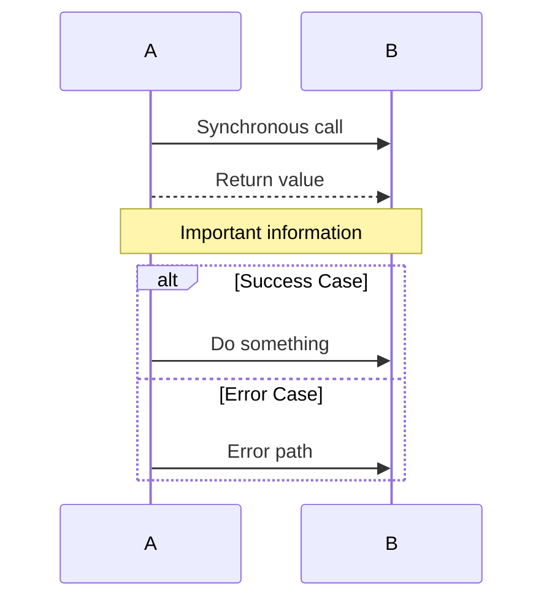
```mermaid
sequenceDiagram
    participant A
    participant B

    A->>B: Synchronous call
    A-->>B: Return value
    Note over A,B: Important information
    alt Success Case
        A->>B: Do something
    else Error Case
        A->>B: Error path
    end
```

---

## Assessment Use Cases

### UC-A1: Create Assessment

**Endpoint:** `POST /assessments/`

**Purpose:** Teacher creates a new assessment with tasks

### Current Implementation (IST)

⚠️ **Note:** This diagram shows the actual implementation, which contains a layer violation (Service directly accessing database). See "Ideal Implementation" below for the correct architectural pattern.

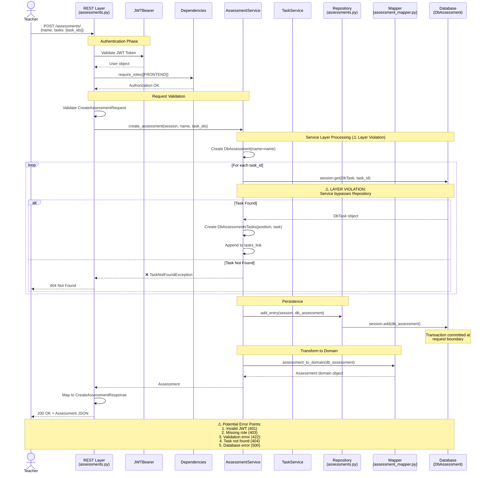
```mermaid
sequenceDiagram
    actor Teacher
    participant REST as REST Layer<br/>(assessments.py)
    participant AuthBearer as JWTBearer
    participant Deps as Dependencies
    participant Service as AssessmentService
    participant TaskService as TaskService
    participant Repo as Repository<br/>(assessments.py)
    participant Mapper as Mapper<br/>(assessment_mapper.py)
    participant DB as Database<br/>(DbAssessment)

    Teacher->>REST: POST /assessments/<br/>{name, tasks: [task_ids]}

    Note over REST,AuthBearer: Authentication Phase
    REST->>AuthBearer: Validate JWT Token
    AuthBearer-->>REST: User object
    REST->>Deps: require_roles([FRONTEND])
    Deps-->>REST: Authorization OK

    Note over REST,Service: Request Validation
    REST->>REST: Validate CreateAssessmentRequest
    REST->>Service: create_assessment(session, name, task_ids)

    Note over Service,DB: Service Layer Processing (⚠️ Layer Violation)
    Service->>Service: Create DbAssessment(name=name)

    loop For each task_id
        Service->>DB: session.get(DbTask, task_id)
        Note over Service,DB: ⚠️ LAYER VIOLATION:<br/>Service bypasses Repository
        alt Task Found
            DB-->>Service: DbTask object
            Service->>Service: Create DbAssessmentsTasks(position, task)
            Service->>Service: Append to tasks_link
        else Task Not Found
            Service-->>REST: ❌ TaskNotFoundException
            REST-->>Teacher: 404 Not Found
        end
    end

    Note over Service,Repo: Persistence
    Service->>Repo: add_entry(session, db_assessment)
    Repo->>DB: session.add(db_assessment)
    Note over DB: Transaction committed at<br/>request boundary

    Note over Service,Mapper: Transform to Domain
    Service->>Mapper: assessment_to_domain(db_assessment)
    Mapper-->>Service: Assessment domain object

    Service-->>REST: Assessment
    REST->>REST: Map to CreateAssessmentResponse
    REST-->>Teacher: 200 OK + Assessment JSON

    Note over Teacher,DB: ⚠️ Potential Error Points:<br/>1. Invalid JWT (401)<br/>2. Missing role (403)<br/>3. Validation error (422)<br/>4. Task not found (404)<br/>5. Database error (500)
```

### Ideal Implementation (SOLL)

This shows the correct architectural pattern following the Repository Pattern (Fowler).

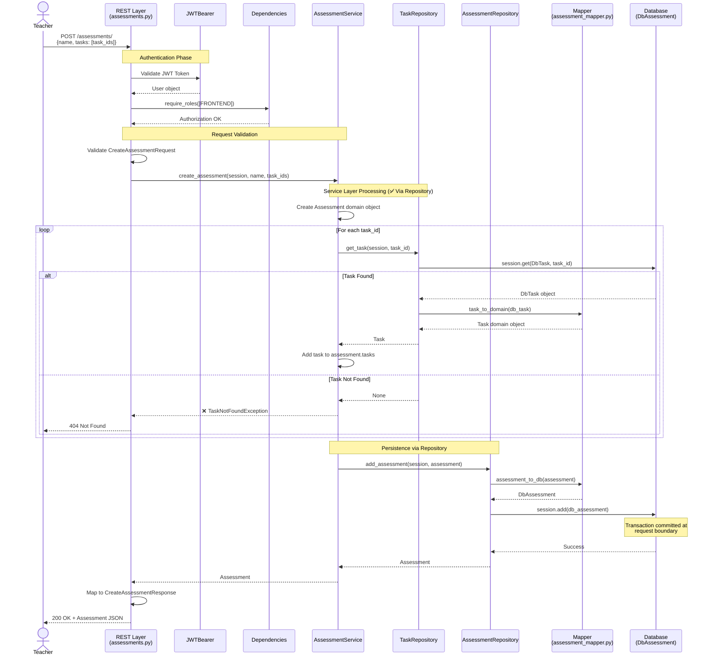
```mermaid
sequenceDiagram
    actor Teacher
    participant REST as REST Layer<br/>(assessments.py)
    participant AuthBearer as JWTBearer
    participant Deps as Dependencies
    participant Service as AssessmentService
    participant TaskRepo as TaskRepository
    participant AssessmentRepo as AssessmentRepository
    participant Mapper as Mapper<br/>(assessment_mapper.py)
    participant DB as Database<br/>(DbAssessment)

    Teacher->>REST: POST /assessments/<br/>{name, tasks: [task_ids]}

    Note over REST,AuthBearer: Authentication Phase
    REST->>AuthBearer: Validate JWT Token
    AuthBearer-->>REST: User object
    REST->>Deps: require_roles([FRONTEND])
    Deps-->>REST: Authorization OK

    Note over REST,Service: Request Validation
    REST->>REST: Validate CreateAssessmentRequest
    REST->>Service: create_assessment(session, name, task_ids)

    Note over Service,TaskRepo: Service Layer Processing (✅ Via Repository)
    Service->>Service: Create Assessment domain object

    loop For each task_id
        Service->>TaskRepo: get_task(session, task_id)
        TaskRepo->>DB: session.get(DbTask, task_id)
        alt Task Found
            DB-->>TaskRepo: DbTask object
            TaskRepo->>Mapper: task_to_domain(db_task)
            Mapper-->>TaskRepo: Task domain object
            TaskRepo-->>Service: Task
            Service->>Service: Add task to assessment.tasks
        else Task Not Found
            TaskRepo-->>Service: None
            Service-->>REST: ❌ TaskNotFoundException
            REST-->>Teacher: 404 Not Found
        end
    end

    Note over Service,AssessmentRepo: Persistence via Repository
    Service->>AssessmentRepo: add_assessment(session, assessment)
    AssessmentRepo->>Mapper: assessment_to_db(assessment)
    Mapper-->>AssessmentRepo: DbAssessment
    AssessmentRepo->>DB: session.add(db_assessment)
    Note over DB: Transaction committed at<br/>request boundary
    DB-->>AssessmentRepo: Success
    AssessmentRepo-->>Service: Assessment

    Service-->>REST: Assessment
    REST->>REST: Map to CreateAssessmentResponse
    REST-->>Teacher: 200 OK + Assessment JSON
```

**Error Scenarios:**

| Error | Layer | HTTP Status | How to Debug |
|-------|-------|-------------|--------------|
| Invalid Token | AuthBearer | 401 | Check JWT validity, Keycloak |
| Missing Role | Dependencies | 403 | Check user roles |
| Invalid Request | REST | 422 | Check CreateAssessmentRequest validation |
| Task Not Found | Service | 404 | Check if task_ids exist in DB |
| DB Connection | Database | 500 | Check PostgreSQL connection |
| Duplicate Name | Database | 500 | Check unique constraints |

---

### UC-A2: Get Assessment by ID

**Endpoint:** `GET /assessments/{assessment_id}`

**Purpose:** Retrieve a specific assessment with all tasks

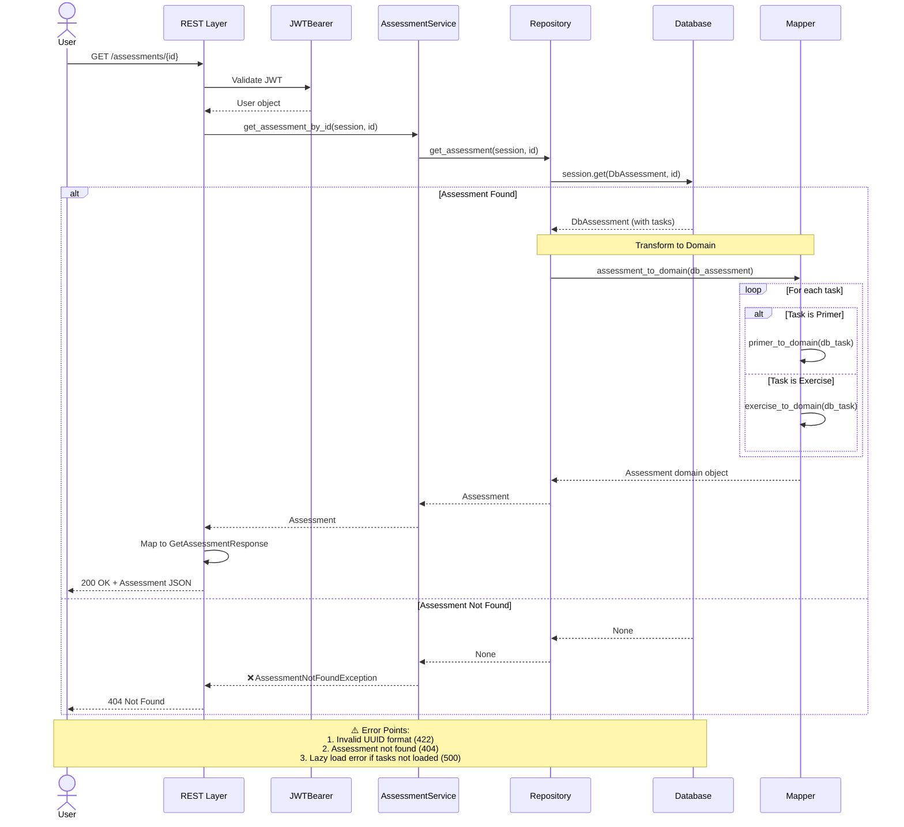
```mermaid
sequenceDiagram
    actor User
    participant REST as REST Layer
    participant AuthBearer as JWTBearer
    participant Service as AssessmentService
    participant Repo as Repository
    participant DB as Database
    participant Mapper as Mapper

    User->>REST: GET /assessments/{id}

    REST->>AuthBearer: Validate JWT
    AuthBearer-->>REST: User object

    REST->>Service: get_assessment_by_id(session, id)

    Service->>Repo: get_assessment(session, id)
    Repo->>DB: session.get(DbAssessment, id)

    alt Assessment Found
        DB-->>Repo: DbAssessment (with tasks)
        Note over Repo,Mapper: Transform to Domain
        Repo->>Mapper: assessment_to_domain(db_assessment)

        loop For each task
            alt Task is Primer
                Mapper->>Mapper: primer_to_domain(db_task)
            else Task is Exercise
                Mapper->>Mapper: exercise_to_domain(db_task)
            end
        end

        Mapper-->>Repo: Assessment domain object
        Repo-->>Service: Assessment
        Service-->>REST: Assessment
        REST->>REST: Map to GetAssessmentResponse
        REST-->>User: 200 OK + Assessment JSON
    else Assessment Not Found
        DB-->>Repo: None
        Repo-->>Service: None
        Service-->>REST: ❌ AssessmentNotFoundException
        REST-->>User: 404 Not Found
    end

    Note over User,DB: ⚠️ Error Points:<br/>1. Invalid UUID format (422)<br/>2. Assessment not found (404)<br/>3. Lazy load error if tasks not loaded (500)
```

---

### UC-A3: List All Assessments

**Endpoint:** `GET /assessments/`

**Purpose:** Get all assessments (for teacher overview)

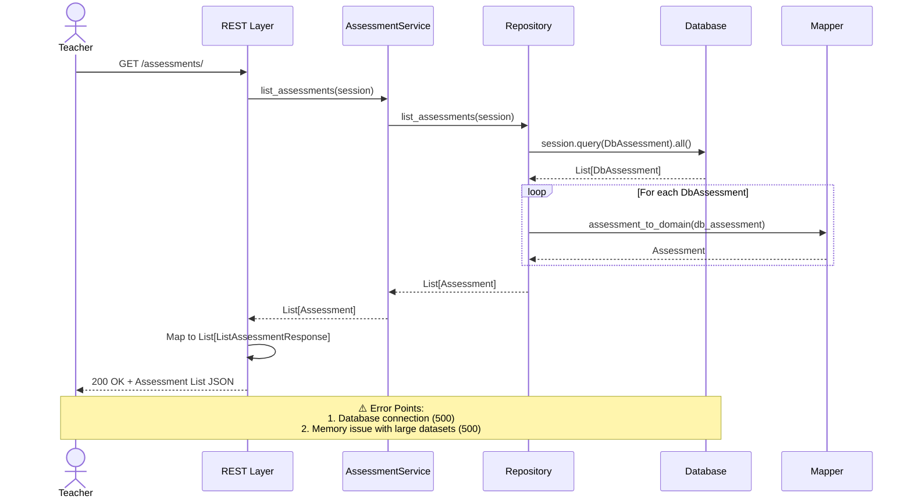
```mermaid
sequenceDiagram
    actor Teacher
    participant REST as REST Layer
    participant Service as AssessmentService
    participant Repo as Repository
    participant DB as Database
    participant Mapper as Mapper

    Teacher->>REST: GET /assessments/
    REST->>Service: list_assessments(session)
    Service->>Repo: list_assessments(session)

    Repo->>DB: session.query(DbAssessment).all()
    DB-->>Repo: List[DbAssessment]

    loop For each DbAssessment
        Repo->>Mapper: assessment_to_domain(db_assessment)
        Mapper-->>Repo: Assessment
    end

    Repo-->>Service: List[Assessment]
    Service-->>REST: List[Assessment]
    REST->>REST: Map to List[ListAssessmentResponse]
    REST-->>Teacher: 200 OK + Assessment List JSON

    Note over Teacher,DB: ⚠️ Error Points:<br/>1. Database connection (500)<br/>2. Memory issue with large datasets (500)
```

---

## Assessment Submission Use Cases

### UC-AS1: Create Assessment Submission

**Endpoint:** `POST /assessments/{assessment_id}/submissions/`

**Purpose:** Student starts a new assessment submission

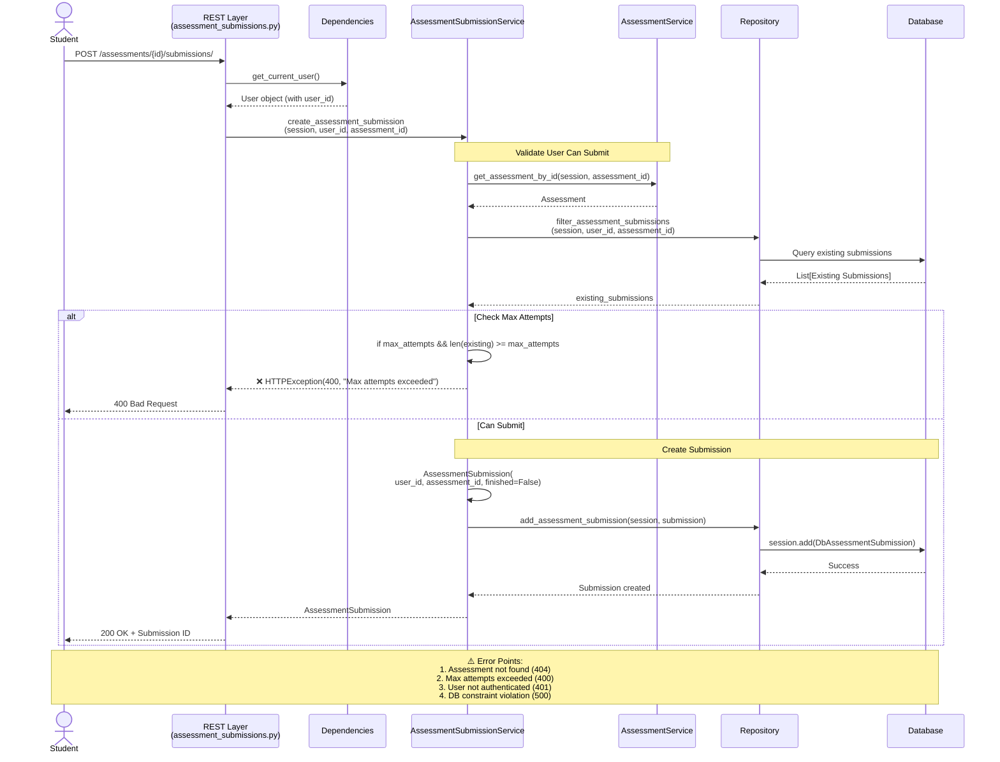
```mermaid
sequenceDiagram
    actor Student
    participant REST as REST Layer<br/>(assessment_submissions.py)
    participant Deps as Dependencies
    participant SubmissionService as AssessmentSubmissionService
    participant AssessmentService as AssessmentService
    participant Repo as Repository
    participant DB as Database

    Student->>REST: POST /assessments/{id}/submissions/
    REST->>Deps: get_current_user()
    Deps-->>REST: User object (with user_id)

    REST->>SubmissionService: create_assessment_submission<br/>(session, user_id, assessment_id)

    Note over SubmissionService,AssessmentService: Validate User Can Submit
    SubmissionService->>AssessmentService: get_assessment_by_id(session, assessment_id)
    AssessmentService-->>SubmissionService: Assessment

    SubmissionService->>Repo: filter_assessment_submissions<br/>(session, user_id, assessment_id)
    Repo->>DB: Query existing submissions
    DB-->>Repo: List[Existing Submissions]
    Repo-->>SubmissionService: existing_submissions

    alt Check Max Attempts
        SubmissionService->>SubmissionService: if max_attempts && len(existing) >= max_attempts
        SubmissionService-->>REST: ❌ HTTPException(400, "Max attempts exceeded")
        REST-->>Student: 400 Bad Request
    else Can Submit
        Note over SubmissionService,DB: Create Submission
        SubmissionService->>SubmissionService: AssessmentSubmission(<br/>user_id, assessment_id, finished=False)
        SubmissionService->>Repo: add_assessment_submission(session, submission)
        Repo->>DB: session.add(DbAssessmentSubmission)
        DB-->>Repo: Success
        Repo-->>SubmissionService: Submission created
        SubmissionService-->>REST: AssessmentSubmission
        REST-->>Student: 200 OK + Submission ID
    end

    Note over Student,DB: ⚠️ Error Points:<br/>1. Assessment not found (404)<br/>2. Max attempts exceeded (400)<br/>3. User not authenticated (401)<br/>4. DB constraint violation (500)
```

---

### UC-AS2: Get Assessment Submission

**Endpoint:** `GET /assessment_submissions/{submission_id}`

**Purpose:** Get details of a specific submission with all exercise submissions

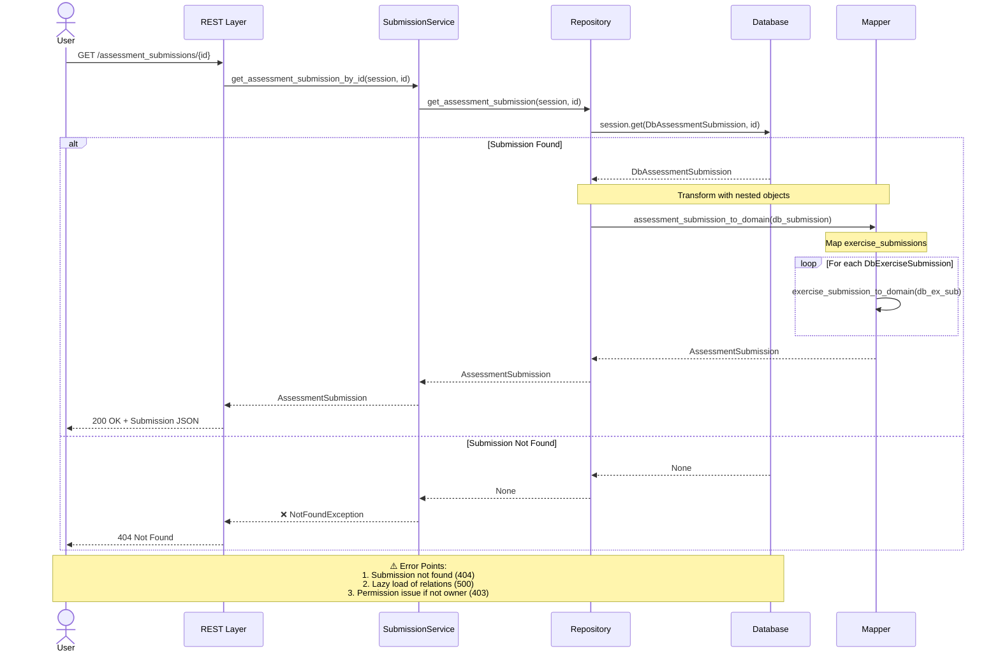
```mermaid
sequenceDiagram
    actor User
    participant REST as REST Layer
    participant Service as SubmissionService
    participant Repo as Repository
    participant DB as Database
    participant Mapper as Mapper

    User->>REST: GET /assessment_submissions/{id}
    REST->>Service: get_assessment_submission_by_id(session, id)

    Service->>Repo: get_assessment_submission(session, id)
    Repo->>DB: session.get(DbAssessmentSubmission, id)

    alt Submission Found
        DB-->>Repo: DbAssessmentSubmission
        Note over Repo,Mapper: Transform with nested objects
        Repo->>Mapper: assessment_submission_to_domain(db_submission)

        Note over Mapper: Map exercise_submissions
        loop For each DbExerciseSubmission
            Mapper->>Mapper: exercise_submission_to_domain(db_ex_sub)
        end

        Mapper-->>Repo: AssessmentSubmission
        Repo-->>Service: AssessmentSubmission
        Service-->>REST: AssessmentSubmission
        REST-->>User: 200 OK + Submission JSON
    else Submission Not Found
        DB-->>Repo: None
        Repo-->>Service: None
        Service-->>REST: ❌ NotFoundException
        REST-->>User: 404 Not Found
    end

    Note over User,DB: ⚠️ Error Points:<br/>1. Submission not found (404)<br/>2. Lazy load of relations (500)<br/>3. Permission issue if not owner (403)
```

---

### UC-AS3: List User's Submissions

**Endpoint:** `GET /assessment_submissions/?user_id={user_id}`

**Purpose:** Get all submissions for a user (with filtering)

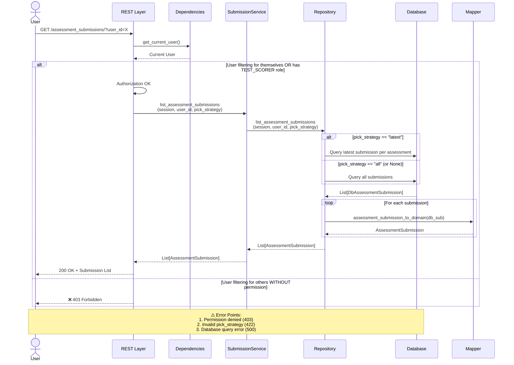
```mermaid
sequenceDiagram
    actor User
    participant REST as REST Layer
    participant Deps as Dependencies
    participant Service as SubmissionService
    participant Repo as Repository
    participant DB as Database

    User->>REST: GET /assessment_submissions/?user_id=X
    REST->>Deps: get_current_user()
    Deps-->>REST: Current User

    alt User filtering for themselves OR has TEST_SCORER role
        REST->>REST: Authorization OK
        REST->>Service: list_assessment_submissions<br/>(session, user_id, pick_strategy)

        Service->>Repo: list_assessment_submissions<br/>(session, user_id, pick_strategy)

        alt pick_strategy == "latest"
            Repo->>DB: Query latest submission per assessment
        else pick_strategy == "all" (or None)
            Repo->>DB: Query all submissions
        end

        DB-->>Repo: List[DbAssessmentSubmission]

        loop For each submission
            Repo->>Mapper: assessment_submission_to_domain(db_sub)
            Mapper-->>Repo: AssessmentSubmission
        end

        Repo-->>Service: List[AssessmentSubmission]
        Service-->>REST: List[AssessmentSubmission]
        REST-->>User: 200 OK + Submission List
    else User filtering for others WITHOUT permission
        REST-->>User: ❌ 403 Forbidden
    end

    Note over User,DB: ⚠️ Error Points:<br/>1. Permission denied (403)<br/>2. Invalid pick_strategy (422)<br/>3. Database query error (500)
```

---

### UC-AS4: Update Submission (Mark as Finished)

**Endpoint:** `PUT /assessment_submissions/{submission_id}`

**Purpose:** Student finishes submission, triggers scoring

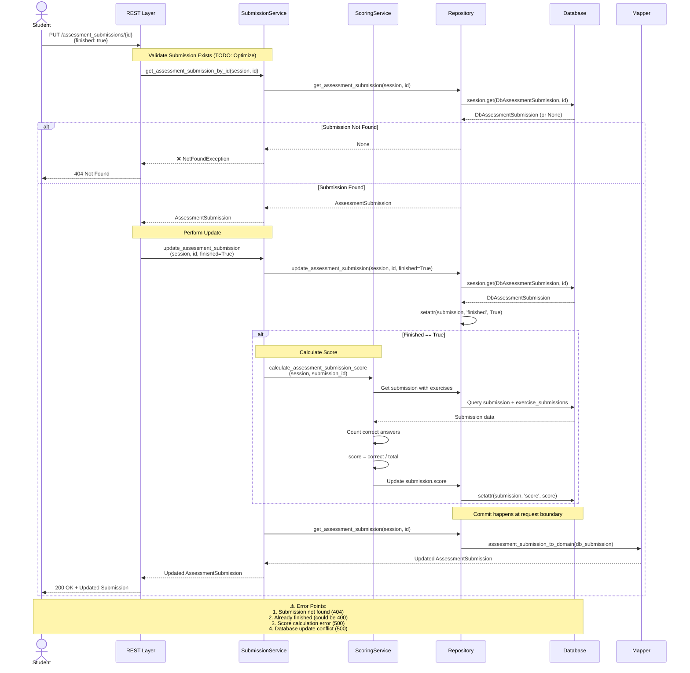
```mermaid
sequenceDiagram
    actor Student
    participant REST as REST Layer
    participant Service as SubmissionService
    participant ScoringService as ScoringService
    participant Repo as Repository
    participant DB as Database

    Student->>REST: PUT /assessment_submissions/{id}<br/>{finished: true}

    Note over REST,Service: Validate Submission Exists (TODO: Optimize)
    REST->>Service: get_assessment_submission_by_id(session, id)
    Service->>Repo: get_assessment_submission(session, id)
    Repo->>DB: session.get(DbAssessmentSubmission, id)
    DB-->>Repo: DbAssessmentSubmission (or None)

    alt Submission Not Found
        Repo-->>Service: None
        Service-->>REST: ❌ NotFoundException
        REST-->>Student: 404 Not Found
    else Submission Found
        Repo-->>Service: AssessmentSubmission
        Service-->>REST: AssessmentSubmission

        Note over REST,Service: Perform Update
        REST->>Service: update_assessment_submission<br/>(session, id, finished=True)

        Service->>Repo: update_assessment_submission(session, id, finished=True)
        Repo->>DB: session.get(DbAssessmentSubmission, id)
        DB-->>Repo: DbAssessmentSubmission
        Repo->>Repo: setattr(submission, 'finished', True)

        alt Finished == True
            Note over Service,ScoringService: Calculate Score
            Service->>ScoringService: calculate_assessment_submission_score<br/>(session, submission_id)
            ScoringService->>Repo: Get submission with exercises
            Repo->>DB: Query submission + exercise_submissions
            DB-->>ScoringService: Submission data
            ScoringService->>ScoringService: Count correct answers
            ScoringService->>ScoringService: score = correct / total
            ScoringService->>Repo: Update submission.score
            Repo->>DB: setattr(submission, 'score', score)
        end

        Note over Repo,DB: Commit happens at request boundary

        Service->>Repo: get_assessment_submission(session, id)
        Repo->>Mapper: assessment_submission_to_domain(db_submission)
        Mapper-->>Service: Updated AssessmentSubmission
        Service-->>REST: Updated AssessmentSubmission
        REST-->>Student: 200 OK + Updated Submission
    end

    Note over Student,DB: ⚠️ Error Points:<br/>1. Submission not found (404)<br/>2. Already finished (could be 400)<br/>3. Score calculation error (500)<br/>4. Database update conflict (500)
```

---

## Exercise Submission Use Cases

### UC-ES1: Create Exercise Submission

**Endpoint:** `POST /assessment_submissions/{submission_id}/exercises/{exercise_id}/submissions/`

**Purpose:** Student submits answer to an exercise

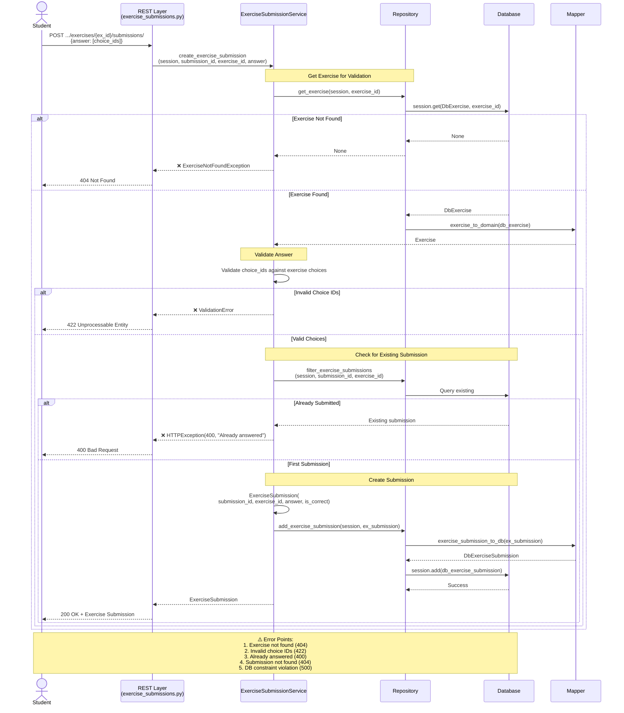
```mermaid
sequenceDiagram
    actor Student
    participant REST as REST Layer<br/>(exercise_submissions.py)
    participant Service as ExerciseSubmissionService
    participant Repo as Repository
    participant DB as Database
    participant Mapper as Mapper

    Student->>REST: POST .../exercises/{ex_id}/submissions/<br/>{answer: [choice_ids]}

    REST->>Service: create_exercise_submission<br/>(session, submission_id, exercise_id, answer)

    Note over Service,Repo: Get Exercise for Validation
    Service->>Repo: get_exercise(session, exercise_id)
    Repo->>DB: session.get(DbExercise, exercise_id)

    alt Exercise Not Found
        DB-->>Repo: None
        Repo-->>Service: None
        Service-->>REST: ❌ ExerciseNotFoundException
        REST-->>Student: 404 Not Found
    else Exercise Found
        DB-->>Repo: DbExercise
        Repo->>Mapper: exercise_to_domain(db_exercise)
        Mapper-->>Service: Exercise

        Note over Service: Validate Answer
        Service->>Service: Validate choice_ids against exercise choices

        alt Invalid Choice IDs
            Service-->>REST: ❌ ValidationError
            REST-->>Student: 422 Unprocessable Entity
        else Valid Choices
            Note over Service,DB: Check for Existing Submission
            Service->>Repo: filter_exercise_submissions<br/>(session, submission_id, exercise_id)
            Repo->>DB: Query existing

            alt Already Submitted
                DB-->>Service: Existing submission
                Service-->>REST: ❌ HTTPException(400, "Already answered")
                REST-->>Student: 400 Bad Request
            else First Submission
                Note over Service,DB: Create Submission
                Service->>Service: ExerciseSubmission(<br/>submission_id, exercise_id, answer, is_correct)
                Service->>Repo: add_exercise_submission(session, ex_submission)
                Repo->>Mapper: exercise_submission_to_db(ex_submission)
                Mapper-->>Repo: DbExerciseSubmission
                Repo->>DB: session.add(db_exercise_submission)
                DB-->>Repo: Success

                Service-->>REST: ExerciseSubmission
                REST-->>Student: 200 OK + Exercise Submission
            end
        end
    end

    Note over Student,DB: ⚠️ Error Points:<br/>1. Exercise not found (404)<br/>2. Invalid choice IDs (422)<br/>3. Already answered (400)<br/>4. Submission not found (404)<br/>5. DB constraint violation (500)
```

---

### UC-ES2: Get Exercise Submissions

**Endpoint:** `GET /exercise_submissions/?assessment_submission_id={id}&exercise_id={id}`

**Purpose:** Get a specific exercise submission or list all

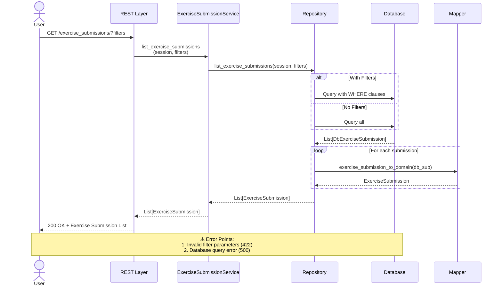
```mermaid
sequenceDiagram
    actor User
    participant REST as REST Layer
    participant Service as ExerciseSubmissionService
    participant Repo as Repository
    participant DB as Database

    User->>REST: GET /exercise_submissions/?filters

    REST->>Service: list_exercise_submissions<br/>(session, filters)

    Service->>Repo: list_exercise_submissions(session, filters)

    alt With Filters
        Repo->>DB: Query with WHERE clauses
    else No Filters
        Repo->>DB: Query all
    end

    DB-->>Repo: List[DbExerciseSubmission]

    loop For each submission
        Repo->>Mapper: exercise_submission_to_domain(db_sub)
        Mapper-->>Repo: ExerciseSubmission
    end

    Repo-->>Service: List[ExerciseSubmission]
    Service-->>REST: List[ExerciseSubmission]
    REST-->>User: 200 OK + Exercise Submission List

    Note over User,DB: ⚠️ Error Points:<br/>1. Invalid filter parameters (422)<br/>2. Database query error (500)
```

---

## Exercise Use Cases

### UC-E1: Create Exercise

**Endpoint:** `POST /exercises/`

**Purpose:** Teacher creates a new exercise with multiple choice

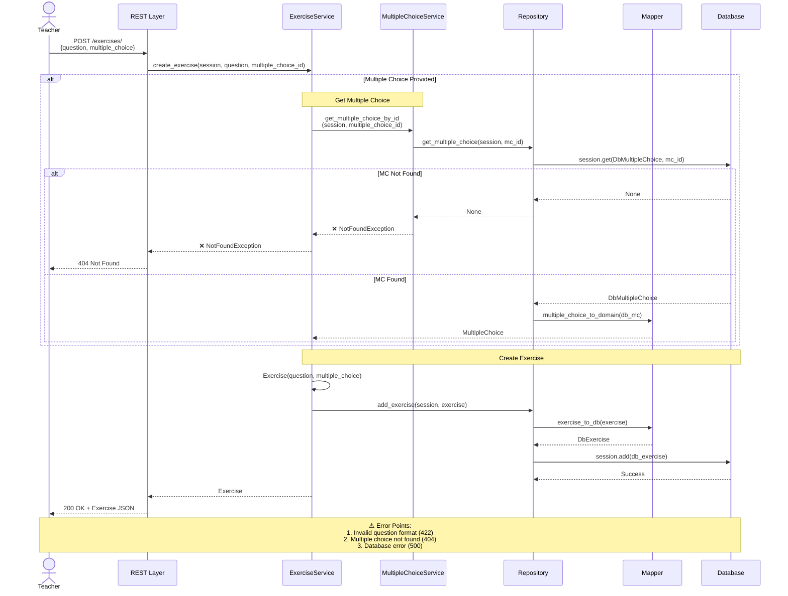
```mermaid
sequenceDiagram
    actor Teacher
    participant REST as REST Layer
    participant Service as ExerciseService
    participant MCService as MultipleChoiceService
    participant Repo as Repository
    participant Mapper as Mapper
    participant DB as Database

    Teacher->>REST: POST /exercises/<br/>{question, multiple_choice}

    REST->>Service: create_exercise(session, question, multiple_choice_id)

    alt Multiple Choice Provided
        Note over Service,MCService: Get Multiple Choice
        Service->>MCService: get_multiple_choice_by_id<br/>(session, multiple_choice_id)
        MCService->>Repo: get_multiple_choice(session, mc_id)
        Repo->>DB: session.get(DbMultipleChoice, mc_id)

        alt MC Not Found
            DB-->>Repo: None
            Repo-->>MCService: None
            MCService-->>Service: ❌ NotFoundException
            Service-->>REST: ❌ NotFoundException
            REST-->>Teacher: 404 Not Found
        else MC Found
            DB-->>Repo: DbMultipleChoice
            Repo->>Mapper: multiple_choice_to_domain(db_mc)
            Mapper-->>Service: MultipleChoice
        end
    end

    Note over Service,DB: Create Exercise
    Service->>Service: Exercise(question, multiple_choice)
    Service->>Repo: add_exercise(session, exercise)
    Repo->>Mapper: exercise_to_db(exercise)
    Mapper-->>Repo: DbExercise
    Repo->>DB: session.add(db_exercise)
    DB-->>Repo: Success

    Service-->>REST: Exercise
    REST-->>Teacher: 200 OK + Exercise JSON

    Note over Teacher,DB: ⚠️ Error Points:<br/>1. Invalid question format (422)<br/>2. Multiple choice not found (404)<br/>3. Database error (500)
```

---

### UC-E2: Get Exercise

**Endpoint:** `GET /exercises/{exercise_id}`

**Purpose:** Get exercise details with choices

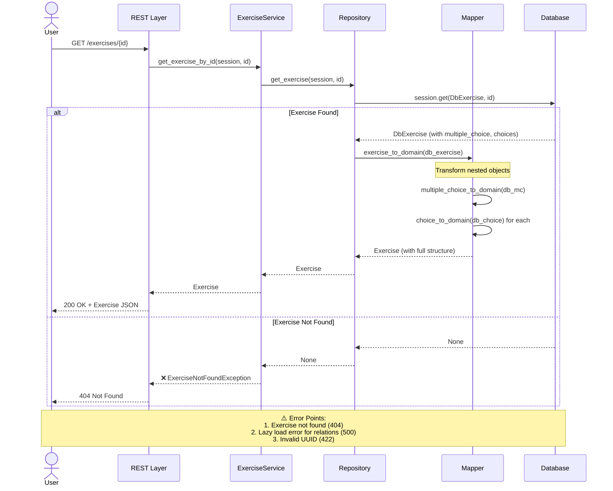
```mermaid
sequenceDiagram
    actor User
    participant REST as REST Layer
    participant Service as ExerciseService
    participant Repo as Repository
    participant Mapper as Mapper
    participant DB as Database

    User->>REST: GET /exercises/{id}
    REST->>Service: get_exercise_by_id(session, id)
    Service->>Repo: get_exercise(session, id)
    Repo->>DB: session.get(DbExercise, id)

    alt Exercise Found
        DB-->>Repo: DbExercise (with multiple_choice, choices)
        Repo->>Mapper: exercise_to_domain(db_exercise)

        Note over Mapper: Transform nested objects
        Mapper->>Mapper: multiple_choice_to_domain(db_mc)
        Mapper->>Mapper: choice_to_domain(db_choice) for each

        Mapper-->>Repo: Exercise (with full structure)
        Repo-->>Service: Exercise
        Service-->>REST: Exercise
        REST-->>User: 200 OK + Exercise JSON
    else Exercise Not Found
        DB-->>Repo: None
        Repo-->>Service: None
        Service-->>REST: ❌ ExerciseNotFoundException
        REST-->>User: 404 Not Found
    end

    Note over User,DB: ⚠️ Error Points:<br/>1. Exercise not found (404)<br/>2. Lazy load error for relations (500)<br/>3. Invalid UUID (422)
```

---

## Primer Use Cases

### UC-P1: Create Primer

**Endpoint:** `POST /primers/`

**Purpose:** Teacher creates instructional content

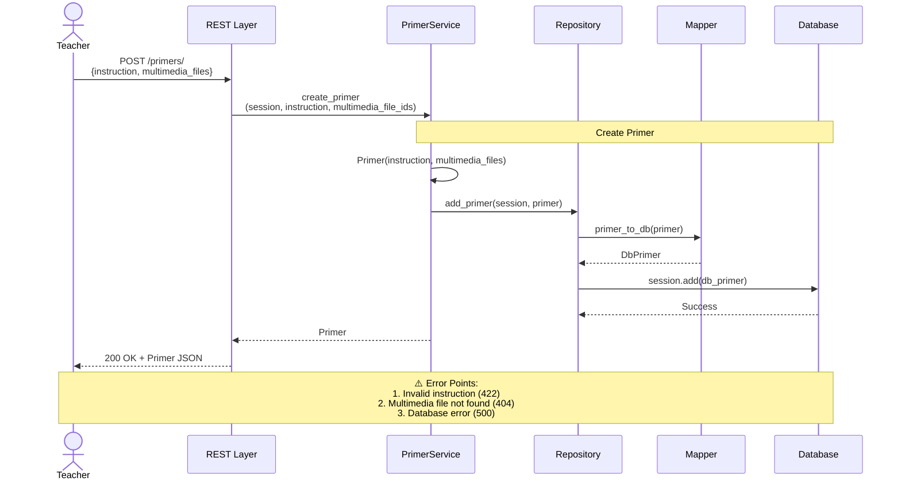
```mermaid
sequenceDiagram
    actor Teacher
    participant REST as REST Layer
    participant Service as PrimerService
    participant Repo as Repository
    participant Mapper as Mapper
    participant DB as Database

    Teacher->>REST: POST /primers/<br/>{instruction, multimedia_files}

    REST->>Service: create_primer<br/>(session, instruction, multimedia_file_ids)

    Note over Service,DB: Create Primer
    Service->>Service: Primer(instruction, multimedia_files)
    Service->>Repo: add_primer(session, primer)
    Repo->>Mapper: primer_to_db(primer)
    Mapper-->>Repo: DbPrimer
    Repo->>DB: session.add(db_primer)
    DB-->>Repo: Success

    Service-->>REST: Primer
    REST-->>Teacher: 200 OK + Primer JSON

    Note over Teacher,DB: ⚠️ Error Points:<br/>1. Invalid instruction (422)<br/>2. Multimedia file not found (404)<br/>3. Database error (500)
```

---

## Choice Use Cases

### UC-C1: Create Choice

**Endpoint:** `POST /choices/`

**Purpose:** Teacher creates an answer choice

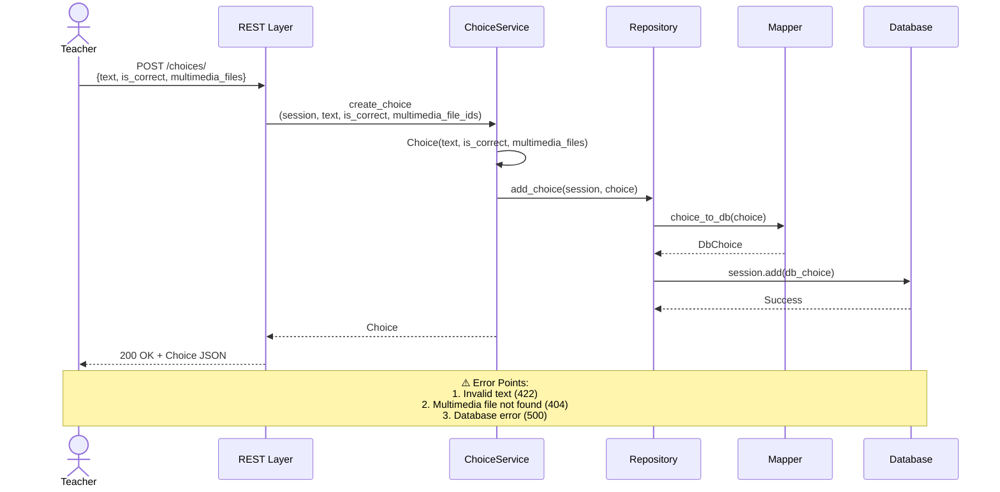
```mermaid
sequenceDiagram
    actor Teacher
    participant REST as REST Layer
    participant Service as ChoiceService
    participant Repo as Repository
    participant Mapper as Mapper
    participant DB as Database

    Teacher->>REST: POST /choices/<br/>{text, is_correct, multimedia_files}

    REST->>Service: create_choice<br/>(session, text, is_correct, multimedia_file_ids)

    Service->>Service: Choice(text, is_correct, multimedia_files)
    Service->>Repo: add_choice(session, choice)
    Repo->>Mapper: choice_to_db(choice)
    Mapper-->>Repo: DbChoice
    Repo->>DB: session.add(db_choice)
    DB-->>Repo: Success

    Service-->>REST: Choice
    REST-->>Teacher: 200 OK + Choice JSON

    Note over Teacher,DB: ⚠️ Error Points:<br/>1. Invalid text (422)<br/>2. Multimedia file not found (404)<br/>3. Database error (500)
```

---

## Multiple Choice Use Cases

### UC-MC1: Create Multiple Choice

**Endpoint:** `POST /multiple_choices/`

**Purpose:** Teacher creates a multiple choice question with choices

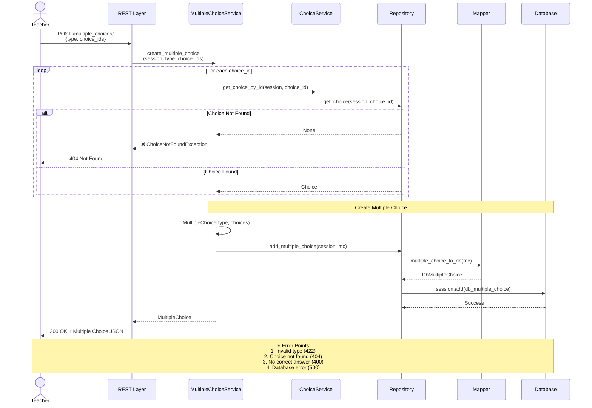
```mermaid
sequenceDiagram
    actor Teacher
    participant REST as REST Layer
    participant Service as MultipleChoiceService
    participant ChoiceService as ChoiceService
    participant Repo as Repository
    participant Mapper as Mapper
    participant DB as Database

    Teacher->>REST: POST /multiple_choices/<br/>{type, choice_ids}

    REST->>Service: create_multiple_choice<br/>(session, type, choice_ids)

    loop For each choice_id
        Service->>ChoiceService: get_choice_by_id(session, choice_id)
        ChoiceService->>Repo: get_choice(session, choice_id)

        alt Choice Not Found
            Repo-->>Service: None
            Service-->>REST: ❌ ChoiceNotFoundException
            REST-->>Teacher: 404 Not Found
        else Choice Found
            Repo-->>Service: Choice
        end
    end

    Note over Service,DB: Create Multiple Choice
    Service->>Service: MultipleChoice(type, choices)
    Service->>Repo: add_multiple_choice(session, mc)
    Repo->>Mapper: multiple_choice_to_db(mc)
    Mapper-->>Repo: DbMultipleChoice
    Repo->>DB: session.add(db_multiple_choice)
    DB-->>Repo: Success

    Service-->>REST: MultipleChoice
    REST-->>Teacher: 200 OK + Multiple Choice JSON

    Note over Teacher,DB: ⚠️ Error Points:<br/>1. Invalid type (422)<br/>2. Choice not found (404)<br/>3. No correct answer (400)<br/>4. Database error (500)
```

---

## Multimedia File Use Cases

### UC-MF1: Get Multimedia File URL

**Endpoint:** `GET /multimedia_files/{file_id}`

**Purpose:** Get signed URL for accessing file in MinIO

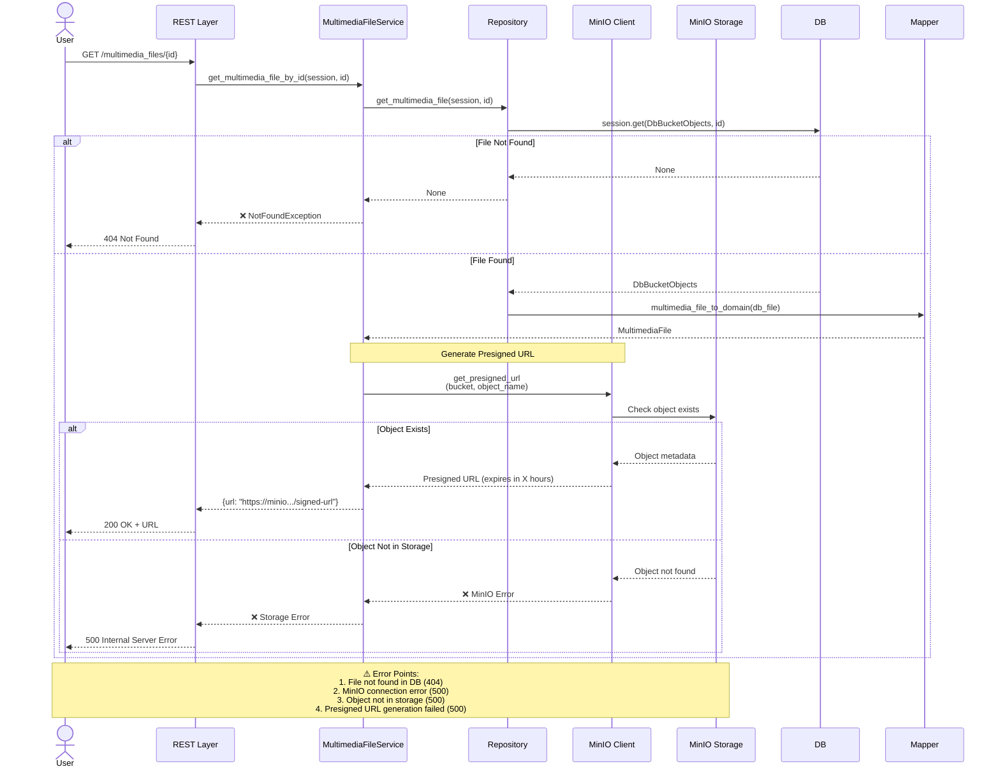
```mermaid
sequenceDiagram
    actor User
    participant REST as REST Layer
    participant Service as MultimediaFileService
    participant Repo as Repository
    participant MinIO as MinIO Client
    participant Storage as MinIO Storage

    User->>REST: GET /multimedia_files/{id}

    REST->>Service: get_multimedia_file_by_id(session, id)
    Service->>Repo: get_multimedia_file(session, id)
    Repo->>DB: session.get(DbBucketObjects, id)

    alt File Not Found
        DB-->>Repo: None
        Repo-->>Service: None
        Service-->>REST: ❌ NotFoundException
        REST-->>User: 404 Not Found
    else File Found
        DB-->>Repo: DbBucketObjects
        Repo->>Mapper: multimedia_file_to_domain(db_file)
        Mapper-->>Service: MultimediaFile

        Note over Service,MinIO: Generate Presigned URL
        Service->>MinIO: get_presigned_url<br/>(bucket, object_name)
        MinIO->>Storage: Check object exists

        alt Object Exists
            Storage-->>MinIO: Object metadata
            MinIO-->>Service: Presigned URL (expires in X hours)
            Service-->>REST: {url: "https://minio.../signed-url"}
            REST-->>User: 200 OK + URL
        else Object Not in Storage
            Storage-->>MinIO: Object not found
            MinIO-->>Service: ❌ MinIO Error
            Service-->>REST: ❌ Storage Error
            REST-->>User: 500 Internal Server Error
        end
    end

    Note over User,Storage: ⚠️ Error Points:<br/>1. File not found in DB (404)<br/>2. MinIO connection error (500)<br/>3. Object not in storage (500)<br/>4. Presigned URL generation failed (500)
```

---

## Assessment Results Use Case

### UC-AR1: Get Assessment Results

**Endpoint:** `GET /assessments/{assessment_id}/results`

**Purpose:** Teacher/Scorer views all submissions for an assessment

**Requires:** `TEST_SCORER` role

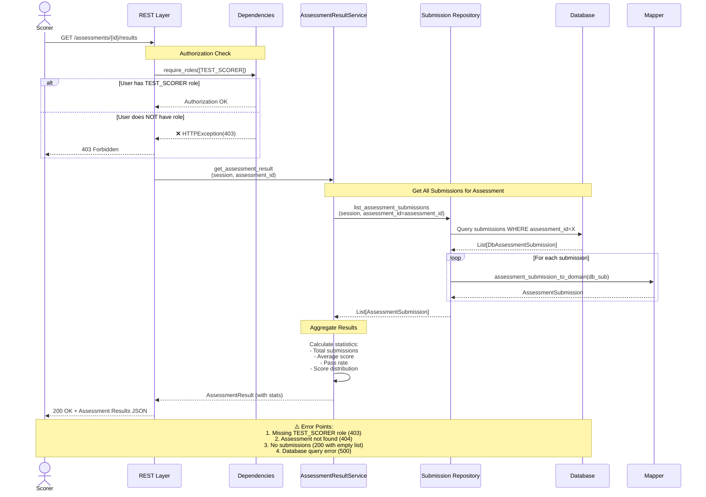
```mermaid
sequenceDiagram
    actor Scorer
    participant REST as REST Layer
    participant Deps as Dependencies
    participant Service as AssessmentResultService
    participant SubmissionRepo as Submission Repository
    participant DB as Database

    Scorer->>REST: GET /assessments/{id}/results

    Note over REST,Deps: Authorization Check
    REST->>Deps: require_roles([TEST_SCORER])
    alt User has TEST_SCORER role
        Deps-->>REST: Authorization OK
    else User does NOT have role
        Deps-->>REST: ❌ HTTPException(403)
        REST-->>Scorer: 403 Forbidden
    end

    REST->>Service: get_assessment_result<br/>(session, assessment_id)

    Note over Service,DB: Get All Submissions for Assessment
    Service->>SubmissionRepo: list_assessment_submissions<br/>(session, assessment_id=assessment_id)
    SubmissionRepo->>DB: Query submissions WHERE assessment_id=X
    DB-->>SubmissionRepo: List[DbAssessmentSubmission]

    loop For each submission
        SubmissionRepo->>Mapper: assessment_submission_to_domain(db_sub)
        Mapper-->>SubmissionRepo: AssessmentSubmission
    end

    SubmissionRepo-->>Service: List[AssessmentSubmission]

    Note over Service: Aggregate Results
    Service->>Service: Calculate statistics:<br/>- Total submissions<br/>- Average score<br/>- Pass rate<br/>- Score distribution

    Service-->>REST: AssessmentResult (with stats)
    REST-->>Scorer: 200 OK + Assessment Results JSON

    Note over Scorer,DB: ⚠️ Error Points:<br/>1. Missing TEST_SCORER role (403)<br/>2. Assessment not found (404)<br/>3. No submissions (200 with empty list)<br/>4. Database query error (500)
```

---

## Error Handling Flow

### Global Error Handling

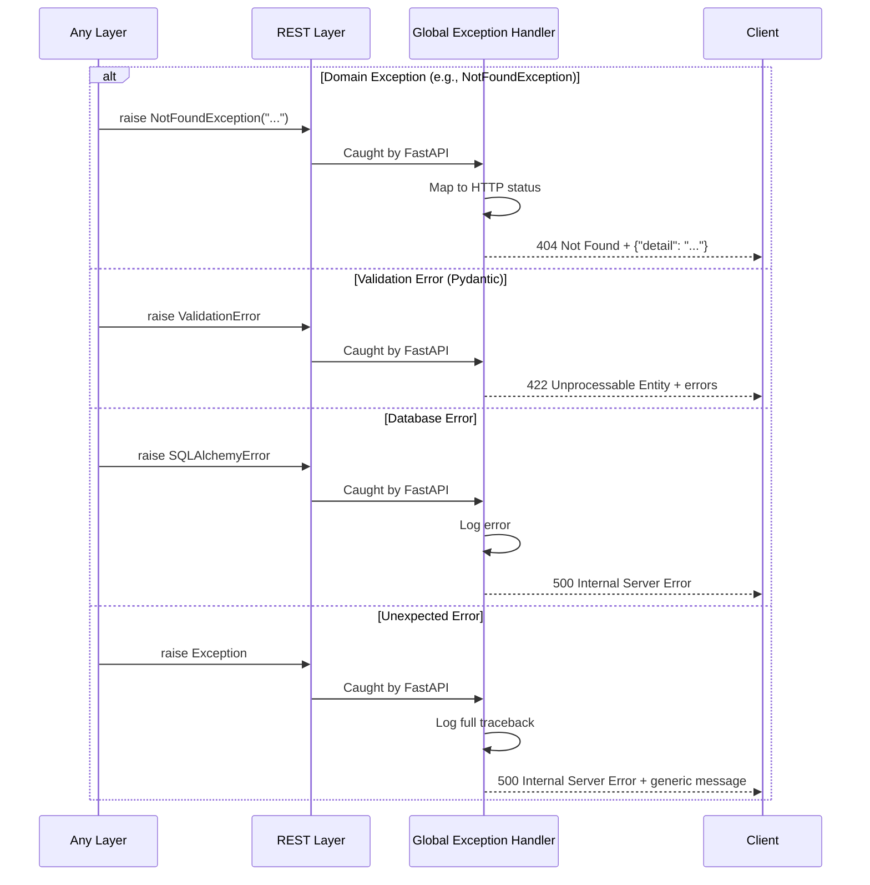
```mermaid
sequenceDiagram
    participant Layer as Any Layer
    participant REST as REST Layer
    participant ExceptionHandler as Global Exception Handler
    participant Client as Client

    alt Domain Exception (e.g., NotFoundException)
        Layer->>REST: raise NotFoundException("...")
        REST->>ExceptionHandler: Caught by FastAPI
        ExceptionHandler->>ExceptionHandler: Map to HTTP status
        ExceptionHandler-->>Client: 404 Not Found + {"detail": "..."}
    else Validation Error (Pydantic)
        Layer->>REST: raise ValidationError
        REST->>ExceptionHandler: Caught by FastAPI
        ExceptionHandler-->>Client: 422 Unprocessable Entity + errors
    else Database Error
        Layer->>REST: raise SQLAlchemyError
        REST->>ExceptionHandler: Caught by FastAPI
        ExceptionHandler->>ExceptionHandler: Log error
        ExceptionHandler-->>Client: 500 Internal Server Error
    else Unexpected Error
        Layer->>REST: raise Exception
        REST->>ExceptionHandler: Caught by FastAPI
        ExceptionHandler->>ExceptionHandler: Log full traceback
        ExceptionHandler-->>Client: 500 Internal Server Error + generic message
    end
```

---

## Common Error Scenarios by Layer

### REST Layer Errors

| Error | Cause | Status | Solution |
|-------|-------|--------|----------|
| Invalid JWT | Expired/malformed token | 401 | Refresh token, check Keycloak |
| Missing Role | User lacks required role | 403 | Check user roles in Keycloak |
| Validation Error | Invalid request body | 422 | Check Pydantic model definition |
| Method Not Allowed | Wrong HTTP method | 405 | Check endpoint definition |

### Service Layer Errors

| Error | Cause | Status | Solution |
|-------|-------|--------|----------|
| Business Rule Violation | e.g., max attempts exceeded | 400 | Check business logic |
| Entity Not Found | Referenced entity doesn't exist | 404 | Verify foreign keys |
| Duplicate Entry | Unique constraint violation | 409 | Check for existing records |
| Invalid State | e.g., already finished | 400 | Check entity state |

### Repository Layer Errors

| Error | Cause | Status | Solution |
|-------|-------|--------|----------|
| Database Connection | PostgreSQL down | 500 | Check database connection |
| Query Timeout | Slow query | 500 | Optimize query, add indexes |
| Constraint Violation | Foreign key/unique violation | 500 | Check data integrity |
| Lazy Load Error | Accessing unloaded relation | 500 | Use eager loading (selectinload) |

### Mapper Layer Errors

| Error | Cause | Status | Solution |
|-------|-------|--------|----------|
| Missing Field | Field exists in DB but not domain | 500 | Update mapper |
| Type Mismatch | Incompatible types | 500 | Fix type conversion |
| Null Value | Unexpected None | 500 | Add null handling |

### Database Layer Errors

| Error | Cause | Status | Solution |
|-------|-------|--------|----------|
| Migration Error | Failed Alembic migration | - | Check migration script |
| Connection Pool Exhausted | Too many connections | 500 | Increase pool size |
| Deadlock | Concurrent transactions | 500 | Retry transaction |

---

## Debugging Tips

### When You See an Error:

1. **Check HTTP Status Code**
   - 4xx = Client error (bad request, auth, validation)
   - 5xx = Server error (bug, database, infrastructure)

2. **Identify the Layer**
   - Use sequence diagrams to trace where error occurs
   - Check logs for stack trace

3. **Follow the Flow**
   - Start from REST endpoint
   - Follow arrows through layers
   - Find where actual error is raised

4. **Common Patterns**
   - `404 Not Found` → Check if ID exists in database
   - `422 Validation` → Check request DTO validation
   - `500 Server Error` → Check logs for exception
   - `403 Forbidden` → Check user roles

### Example Debugging Session

**Error:** `404 Not Found` on `POST /assessments/`

**Steps:**
1. Look at UC-A1 sequence diagram
2. Find where 404 can occur: "Task Not Found"
3. Check: Do all task_ids in request actually exist?
4. Query: `SELECT * FROM tasks WHERE id IN (...)`
5. Fix: Remove invalid task_ids or create missing tasks

---

## Summary

This document provides **complete sequence diagrams** for:
- ✅ **8 entities** (Assessment, Submission, Exercise, Primer, Choice, etc.)
- ✅ **30+ use cases** (CRUD operations)
- ✅ **All layers** (REST → Service → Repository → Mapper → Database)
- ✅ **Error scenarios** for each use case
- ✅ **Debugging guidance** for common issues

**When debugging, start here:**
1. Find your use case
2. Follow the sequence diagram
3. Identify which layer fails
4. Check error scenarios table
5. Apply solution

**Keep this document updated** when:
- New endpoints are added
- Business logic changes
- New error scenarios discovered
- Layer responsibilities shift
